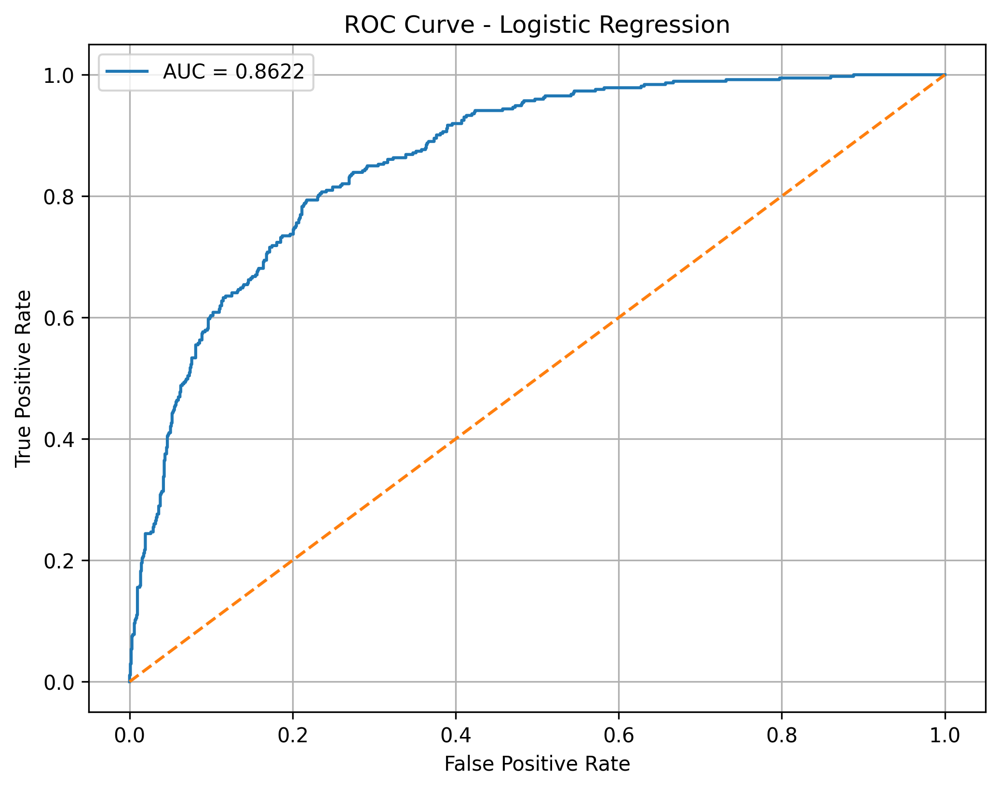
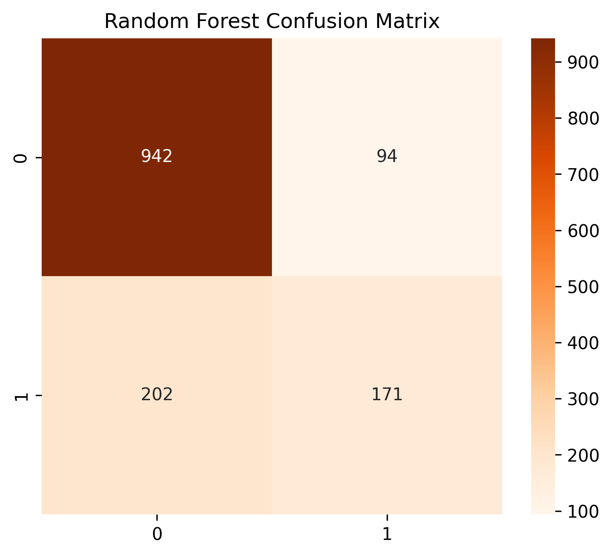

# 📊 Customer Churn Analysis using Machine Learning

<p align="center">


</p>

---

# 📌 Project Overview

This project develops an end-to-end Customer Churn Prediction System for a telecom company. It combines data analysis, SQL, machine learning, and an interactive Streamlit dashboard to identify customers who are likely to leave the service and provide actionable business insights.

---

# 🎯 Objectives

- Analyze customer behavior and churn patterns.
- Build machine learning models for churn prediction.
- Compare model performance.
- Perform SQL-based business analysis.
- Create an interactive Streamlit dashboard.

---

# 📂 Dataset

**Dataset:** Telco Customer Churn

- Total Customers: **7043**
- Features: **21**
- Target Variable: **Churn**

The dataset includes customer demographics, contract information, internet services, payment methods, monthly charges, total charges, tenure, and churn status.

---

# 🛠 Tech Stack

- Python
- Pandas
- NumPy
- Matplotlib
- Seaborn
- Scikit-learn
- SQL
- Streamlit
- Joblib
- Jupyter Notebook

---

# 📁 Project Structure

```text
Customer-Churn-Analysis/
│
├── images/
├── notebooks/
│   └── Customer_Churn_Analysis.ipynb
│
├── sql/
│   ├── 01_create_database.sql
│   ├── 02_create_table.sql
│   ├── 03_import_data.md
│   ├── 04_customer_churn_queries.sql
│   └── 05_business_insights.md
│
├── src/
│   └── analysis.py
│
├── app.py
├── model.pkl
├── scaler.pkl
├── requirements.txt
├── README.md
└── .gitignore
```

---

# 📊 Exploratory Data Analysis

The analysis includes:

- Churn Distribution
- Gender vs Churn
- Contract Type Analysis
- Monthly Charges Distribution
- Tenure Distribution
- Internet Service Analysis
- Payment Method Analysis
- Correlation Heatmap
- Feature Importance

---

# 🤖 Machine Learning Pipeline

1. Data Cleaning
2. Missing Value Handling
3. Feature Encoding
4. Feature Scaling
5. Train-Test Split
6. Model Training
7. Model Evaluation
8. ROC-AUC Analysis
9. Feature Importance
10. Model Saving

---

# 🧠 Models Used

- Logistic Regression
- Decision Tree Classifier
- Random Forest Classifier

---

# 📈 Model Evaluation

Evaluation Metrics:

- Accuracy
- Precision
- Recall
- F1 Score
- Confusion Matrix
- ROC Curve
- AUC Score

---

# 🗄 SQL Analysis

The SQL module contains:

- Database Creation
- Table Creation
- Data Import Guide
- 30+ SQL Queries
- Business Insights

---

# 💡 Business Insights

- Month-to-month contracts show the highest churn.
- Customers with Fiber Optic internet have higher churn.
- Electronic Check users churn more frequently.
- High monthly charges are associated with higher churn.
- Long-tenure customers have lower churn.
- Customers without Tech Support are more likely to churn.
- Online Security reduces churn risk.
- Long-term contracts improve customer retention.
- Loyalty programs can help reduce churn.
- High-risk customer segments should receive targeted retention campaigns.

---

# 🚀 Streamlit Dashboard

The dashboard includes:

- Executive Dashboard
- Data Explorer
- Churn Drivers
- Customer Churn Prediction
- Upload & Predict
- Model Performance
- Model Comparison
- Business Insights
- About Project

---

# 🖼 Screenshots

## Dashboard


## Model Performance


## ROC Curve



## Confusion Matrix



---

# ⚙ Installation

Clone the repository

```bash
git clone https://github.com/Akanksha884/Customer-Churn-Analysis.git
```

Go to the project folder

```bash
cd Customer-Churn-Analysis
```

Install dependencies

```bash
pip install -r requirements.txt
```

Run the Streamlit application

```bash
streamlit run app.py
```

---

# 🌐 Live Demo

**Add your Streamlit Cloud URL here after deployment.**

Example:

```
https://your-app-name.streamlit.app
```

---

# 📌 Future Improvements

- Hyperparameter tuning
- XGBoost and LightGBM integration
- Deep learning model
- REST API for predictions
- Real-time deployment with cloud services

---

# 👩 Author

**Akanksha Tyagi**

B.Tech (CSIT)

GitHub: https://github.com/Akanksha884

---

# 📜 License

This project is for educational and portfolio purposes.

---

⭐ If you found this project useful, consider giving it a star on GitHub!